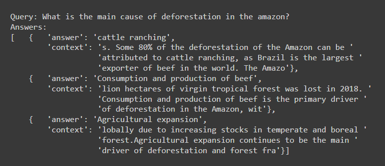

# Environmental Science QA System
 
  

A domain-specific QA system for answering questions about environmental issues.  
  
The system uses the Haystack pipeline to answer questions by querying a set of environment-related Wikipedia articles (dataset <a href=https://github.com/ekohrt/wikipedia-environmental-articles-dataset>here</a>). Runs best in Google Colab.

## Example Output:  
  

  
<i>This is a prototype, not for business or academic use.</i>
